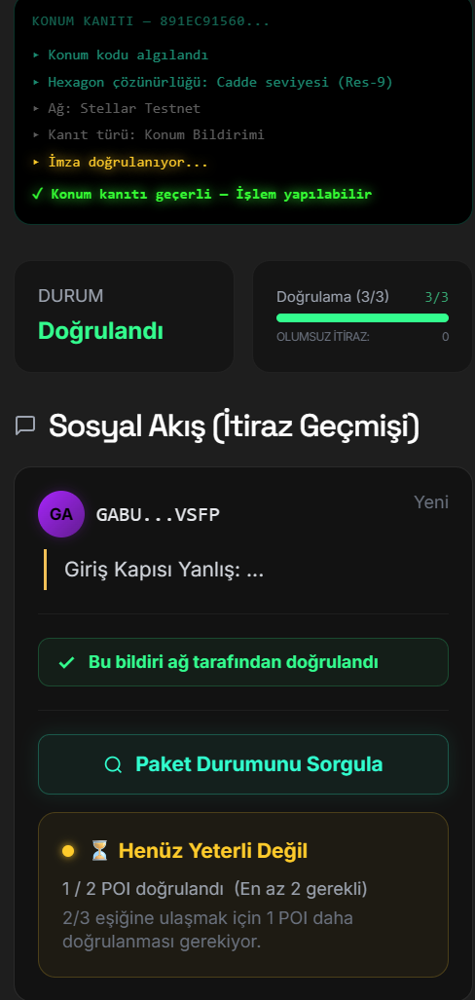
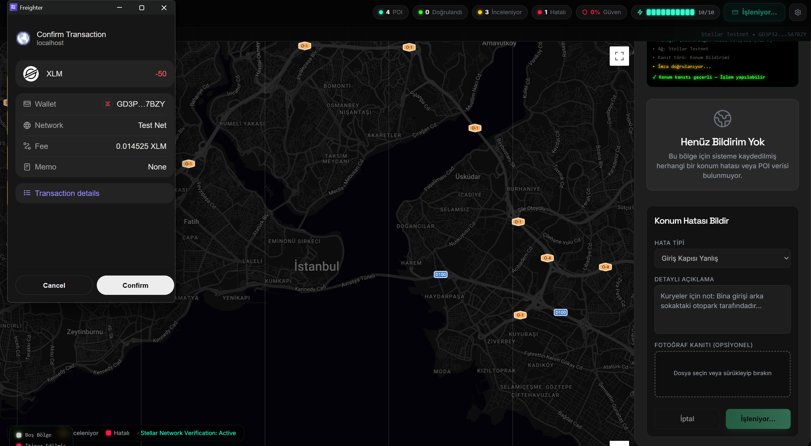
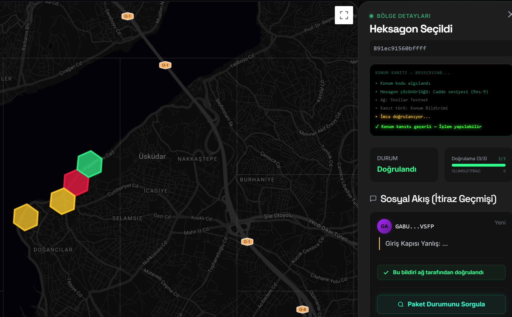
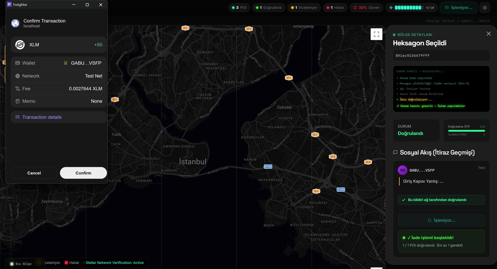
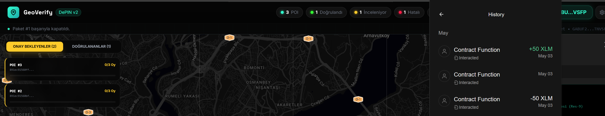
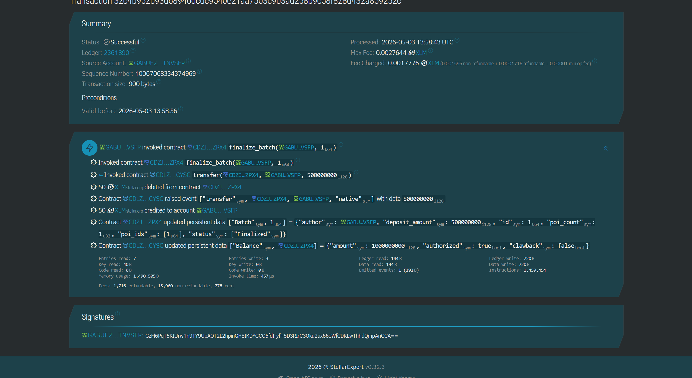

# GeoVerify Soroban

GeoVerify is a decentralized Location-of-Proof (PoL) and Point-of-Interest (POI) verification platform built on the **Stellar Soroban** blockchain. It leverages a decentralized consensus mechanism to ensure the accuracy of physical location data, providing a trust layer for DePIN (Decentralized Physical Infrastructure Networks) projects.

## 🚀 Core Principle: 3-Vote Consensus

The platform operates on a robust verification logic where every reported location or error must be validated by the community.

- **POI Submission:** Users submit a Point of Interest (POI) by staking a batch deposit.
- **Verification Threshold:** For a POI to transition from `Pending` to `Confirmed` status, it must receive **1 unique vote** (Optimized for testing).
- **Visual Feedback:** Confirmed locations are highlighted in **bright green** on the HexGrid, while pending reports remain yellow.
- **Trustless Execution:** Once the 1-vote threshold is met, the POI status is automatically updated on-chain.

## 📸 Visual Demo & Proof of Work

### 1. Batch Staking & POI Submission
Users deposit 50 XLM to open a batch and submit location reports with detailed metadata.
| Batch Staking (-50 XLM) | Submission Form |
|:---:|:---:|
|  |  |

### 2. Map Overview & Consensus
Real-time hexagonal grid showing confirmed (green), pending (yellow), and disputed (red) locations.


### 3. Refund Mechanism (+50 XLM)
Proof of successful batch finalization and the 50 XLM deposit refund triggered by the smart contract.
| Wallet Confirmation | Transaction History |
|:---:|:---:|
|  |  |

### 4. On-Chain Verification
Detailed transaction log on Stellar Expert showing the `finalize_batch` invocation and internal XLM transfer.


## 💰 Economic Model: Deposit & Refund

GeoVerify ensures data integrity through a staking mechanism that rewards honest contributors and penalizes malicious actors.

- **Batch Deposit:** To submit a batch of reports, users must deposit **50 XLM** into the smart contract's vault.
- **Success Rate Threshold:** A batch is eligible for a **full refund** only if at least **2/3 (~66.6%)** of the POIs within it reach the `Confirmed` status (1-vote consensus).
- **Refund Mechanism:** Upon successful verification, the user can trigger the `finalize_batch` function to withdraw their 50 XLM deposit back to their wallet.
- **Slashing:** If the batch fails to meet the verification threshold, the deposit remains locked or can be slashed to fund the protocol treasury for honest verifiers.

## 🛠 Technology Stack

- **Smart Contracts:** Rust-based Soroban contracts utilizing **persistent storage** for cross-ledger data durability.
- **Frontend:** React with TypeScript, providing a real-time interactive dashboard.
- **Mapping:** Google Maps API integrated with **Uber's H3 Hexagonal Hierarchical Spatial Indexing** (Resolution 9 for high-precision street-level accuracy).
- **Wallet Integration:** Freighter Wallet for secure on-chain transactions and identity management.

## 📂 Project Structure

- `/contracts`: Rust source code for the GeoVerify Soroban contract.
- `/src/lib/stellar`: TypeScript client implementation for Soroban RPC interaction.
- `/src/components/Map`: Hexagonal grid rendering logic using H3.
- `/src/components/Panel`: UI components for POI details, voting progress, and batch finalization.

### 🚢 Deployment Details (Testnet)
- **Contract ID:** `CB6LQFULMETTCRBBORJ6RSLR5W7P67H7UXJOJED7QHCKA3MAHEGM5FAY`
- **Deployment Transaction Hash:** [`df94556526a7986697fe891887dfeb7018b2a4dc2835f5c2be6efe98930d23a1`](https://stellar.expert/explorer/testnet/tx/df94556526a7986697fe891887dfeb7018b2a4dc2835f5c2be6efe98930d23a1)
- **Asset (XLM) SAC:** `CDLZFC3SYJYDZT7K67VZ75HPJVIEUVNIXF47ZG2FB2RMQQVU2HHGCYSC`

## 🔧 Getting Started

### Prerequisites
- Node.js & npm
- Stellar CLI
- Freighter Wallet (configured for Testnet)

### Environment Setup
Create a `.env` file in the root directory:
```env
VITE_GOOGLE_MAPS_API_KEY=your_api_key
VITE_GEOVERIFY_CONTRACT_ID=CDZJ55WLCAT4KXV3KJZDBFLQL2C2PI3OSLQ2YI7GU2FFNHTYD6BRZPX4
VITE_SOROBAN_RPC_URL=https://soroban-testnet.stellar.org
VITE_STELLAR_NETWORK=TESTNET
```

### 🚢 Deployment Details (Testnet)
- **Contract ID:** `CDZJ55WLCAT4KXV3KJZDBFLQL2C2PI3OSLQ2YI7GU2FFNHTYD6BRZPX4`
- **Deployment Transaction Hash:** [`4a74ce04fddf616194ab22d96c025f3ffa8f707e7defe149d897b71aaf6f282c`](https://stellar.expert/explorer/testnet/tx/4a74ce04fddf616194ab22d96c025f3ffa8f707e7defe149d897b71aaf6f282c)
- **Asset (XLM) SAC:** `CDLZFC3SYJYDZT7K67VZ75HPJVIEUVNIXF47ZG2FB2RMQQVU2HHGCYSC`


### Contract Build
To build the Soroban contract with the correct target for Stellar, use:
```bash
cd contracts/geoverify
stellar contract build
```
*(Note: Ensure you have the `wasm32v1-none` target installed via rustup for compatibility).*

### Web App Installation
```bash
npm install
npm run dev
```

## 🛡 Security & Integrity

All critical actions, including `submit_poi`, `vote_poi`, and `finalize_batch`, require explicit authorization (`require_auth`) from the user's wallet, ensuring that no third party can manipulate the consensus or refund process.

---
Built with ❤️ for the Stellar DePIN Ecosystem.
